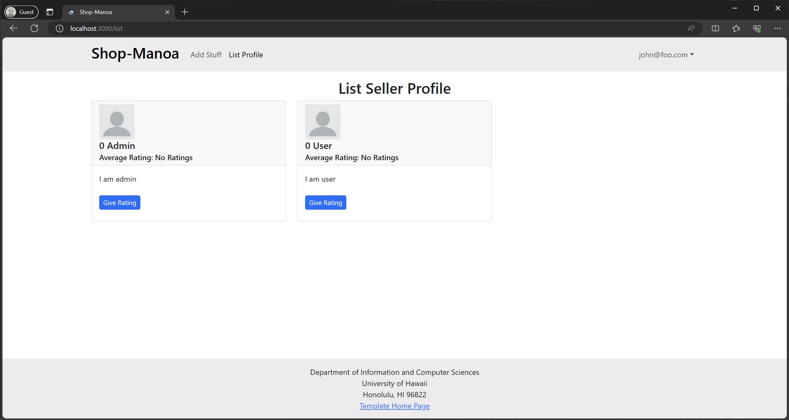
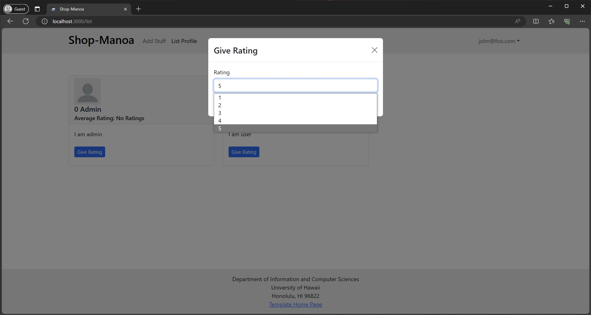
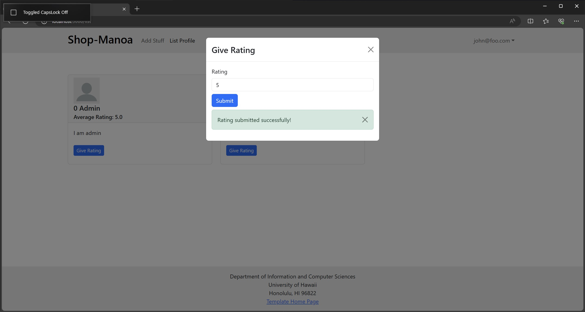

# Shop-Manoa
[Shop Manoa's Team Contract](https://docs.google.com/document/d/1cJpwAVo2HtDnGPQh8G5f4IqFMvtsIkIU4RTED5MFBb0/edit?usp=sharing)

## Table of contents
* [Overview](#overview)
* [Features](#features)
* [Team](#team)
* [Mock-up Ideas](#mock-up-ideas)
* [Developer Guide](#developer-guide)
* [Development History](#development-history)

## Overview
The project, tentatively named "Shop-Manoa", aims to address the rapid turnover of goods and services among students at the University of Hawaii at Manoa (UHM). The primary goal is to create an effective marketplace for campus-specific items, facilitating their recycling and reuse.

Shop-Manoa allows UHM students, faculty, and staff to buy and sell student-related goods and services. This platform is similar to Craigslist, with key differences including the requirement for UH credentials for all users, no anonymity, and the expectation of on-campus transactions.

## Features
* **Roles** (users, admin): users can buy or sell goods and services, while administrators monitor user behavior and manage categories and other functionalities.
* **Categories**: feature broad categories for goods and services.
* **Notifications**: users can opt to receive information via text message.
* **Alerts**: users can set up alerts for specific items they are looking for and will be automatically notified when such items are listed for sale.
* **Photos**: supports upload of photos.
* **Complaints**: users can report inappropriate content or users.

## Team
Shop-Manoa is designed, implemented, and maintained by [Javin Solmirin](https://javinsol.github.io), [Isaac Segawa](https://imths.github.io), [LaToya Gonzales](https://latoyagonzales.github.io), [Ayumu Yamagishi](https://000Aym612.github.io), [Jayrell Allen Ballesteros](https://Kyj1n.github.io), and [Xiaokang Chen](https://XiaoKChenEDU.github.io).

## Mock-up Ideas
  * [Landing page](#landing-page)
  * [User home page](#user-home-page)
  * [Admin home page](#admin-home-page)
  * [User-Profile page](#user-profile-page)
  * [List-Profile page](#list-profile-page)
  * [Categories page](#categories-page)
  * [Category page](#category-page)
  * [Create item page](#create-item-page)
  * [Make offer on item page](#make-offer-on-item-page) 
  * [Notify admin page](#notify-admin-page)
  * [User report page](#user-report-page)

### Landing page
The landing page is presented to users when they visit the top-level URL to the site.

### User home page
Once logged in, the User home page displays an overview of the user's recently viewed items and/or favorite listings, options to create new items, and display of messages/notifications about posted items.

### Admin home page
Once logged in, the Admin home page allows the admin to manage and moderate user accounts, items and services, and issues.

### User-Profile page
The User-Profile page displays user's information (username, profile picture, and bio) and posted item buy/sell with status.

### List-Profile page
The List-Profile page displays the profiles of all registered users on Shop-Manoa. Additionally, it provides the functionality to view and rate these profiles.

TODO: Develop a search feature that allows users to easily find other users.
TODO: Implement a ‘View Profile’ button for each listed profile, which will direct users to the respective User-Profile Page.

### Categories page
The Categories page provides a list of categories of items and services for users to select from.

### Category page
The Category page displays the actual list of items and services of the selected category (filtered).

### Create item page
The Create item page is a form where users can create an item to be put up for sell.

### Make offer on item page
The Make offer on item page is a form where users can put in an offer on an item that they are interested in buying.

### Notify admin page
The Notify admin page is a form for users to report any suspicious or inappropriate activities.

### User report page
- Users can report inappropriate content or users.
- On each post or user account page, a button for reporting will be displayed.
- Once you click the button, you are directed to the report form page.
- What the form asks you? 
  - What content or user you felt inappropriate.
  - How do you categorize the content or user? (e.g. spam, scam, harassment, etc.)
- Once you submit the form, the data is stored into the database to be checked by admin user.

## Developer Guide
WIP

## Development History
Shop-Manoa is deployed to [Digital Ocean](https://cloud.digitalocean.com/droplets/411928794/graphs?i=224881&period=hour)
<h4>Milestone 1: Mock up Development</h4>
Milestone 1 is managed using [Shop-Manoa GitHub Project Board M1](https://github.com/orgs/shop-manoa/projects/1)
<h4>Milestone 2: Deployment</h4>
Milestone 2 is managed using [Shop-Manoa GitHub Project Board M2](https://github.com/orgs/shop-manoa/projects/2)
<h4>Milestone 3: </h4>
WIP
